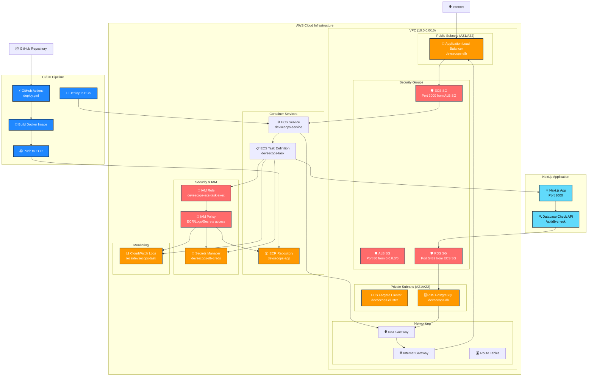
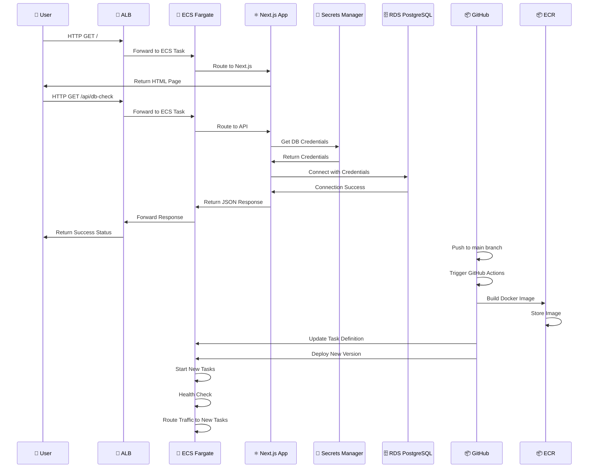
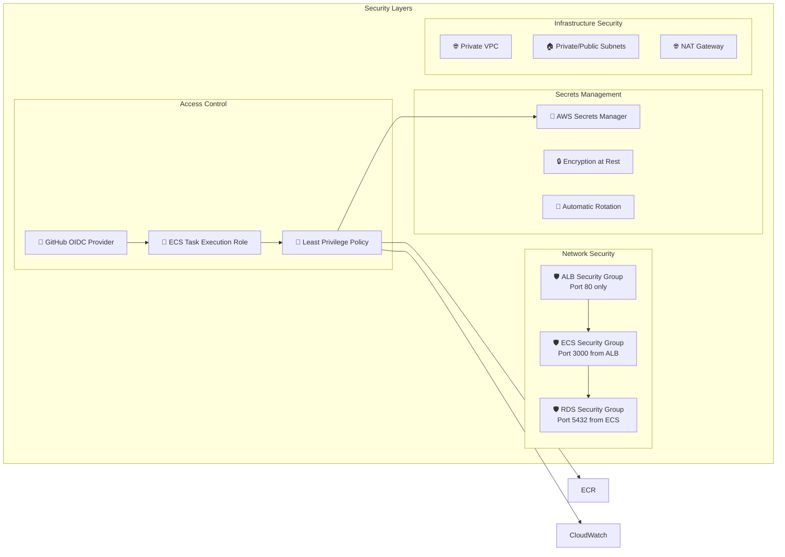
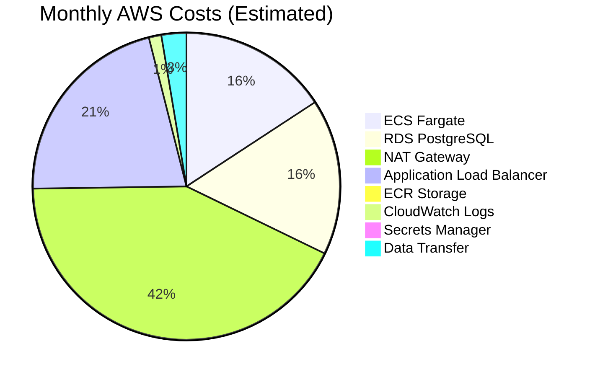

# DevSecOps Challenge - Architecture Diagram

## System Architecture Overview



## Data Flow Diagram



## Security Architecture



## Cost Breakdown



## Key Features Implemented

- ✅ **Infrastructure as Code**: Complete Terraform modules
- ✅ **Container Orchestration**: ECS Fargate with auto-scaling
- ✅ **Database**: RDS PostgreSQL with encryption
- ✅ **Security**: IAM roles, security groups, Secrets Manager
- ✅ **CI/CD**: GitHub Actions with OIDC authentication
- ✅ **Monitoring**: CloudWatch logs and health checks
- ✅ **Networking**: VPC with public/private subnets
- ✅ **Load Balancing**: ALB with health checks

## Repository Structure

```
cctech-take-homes/
├── .github/workflows/
│   └── deploy.yml              # CI/CD Pipeline
├── aws-devops-ecs/
│   └── app/                    # Next.js Application
├── terraform/
│   ├── main.tf                 # Main Terraform Configuration
│   └── modules/
│       └── ecs/                # ECS Module
├── README.md                   # Project Documentation
├── ROLLBACK_INSTRUCTIONS.md    # Cleanup Instructions
└── ARCHITECTURE_DIAGRAM.md     # This File
``` 