# DevSecOps Challenge - Architecture Diagram

## System Architecture Overview

```mermaid
graph TB
    %% External Components
    Internet[🌐 Internet]
    GitHub[📦 GitHub Repository]
    
    %% AWS Services
    subgraph AWS["AWS Cloud Infrastructure"]
        subgraph VPC["VPC (10.0.0.0/16)"]
            subgraph PublicSubnets["Public Subnets (AZ1/AZ2)"]
                ALB[🔄 Application Load Balancer<br/>devsecops-alb]
            end
            
            subgraph PrivateSubnets["Private Subnets (AZ1/AZ2)"]
                ECS[🚢 ECS Fargate Cluster<br/>devsecops-cluster]
                RDS[🗄️ RDS PostgreSQL<br/>devsecops-db]
            end
            
            subgraph SecurityGroups["Security Groups"]
                ALBSG[🛡️ ALB SG<br/>Port 80 from 0.0.0.0/0]
                ECSSG[🛡️ ECS SG<br/>Port 3000 from ALB SG]
                RDSSG[🛡️ RDS SG<br/>Port 5432 from ECS SG]
            end
            
            subgraph Networking["Networking"]
                IGW[🌐 Internet Gateway]
                NAT[🌐 NAT Gateway]
                RT[🛣️ Route Tables]
            end
        end
        
        subgraph ContainerServices["Container Services"]
            ECR[📦 ECR Repository<br/>devsecops-app]
            ECS_Task[📋 ECS Task Definition<br/>devsecops-task]
            ECS_Service[⚙️ ECS Service<br/>devsecops-service]
        end
        
        subgraph Security["Security & IAM"]
            Secrets[🔐 Secrets Manager<br/>devsecops-db-creds]
            IAM_Role[👤 IAM Role<br/>devsecops-ecs-task-exec]
            IAM_Policy[📜 IAM Policy<br/>ECR/Logs/Secrets access]
        end
        
        subgraph Monitoring["Monitoring"]
            CloudWatch[📊 CloudWatch Logs<br/>/ecs/devsecops-task]
        end
    end
    
    %% Application Components
    subgraph App["Next.js Application"]
        NextJS[⚛️ Next.js App<br/>Port 3000]
        DB_Check[🔍 Database Check API<br/>/api/db-check]
    end
    
    %% CI/CD Pipeline
    subgraph CICD["CI/CD Pipeline"]
        GitHub_Actions[⚡ GitHub Actions<br/>deploy.yml]
        Build[🔨 Build Docker Image]
        Push[📤 Push to ECR]
        Deploy[🚀 Deploy to ECS]
    end
    
    %% Connections
    Internet --> ALB
    ALB --> ECSSG
    ECSSG --> ECS_Service
    ECS_Service --> ECS_Task
    ECS_Task --> NextJS
    NextJS --> DB_Check
    DB_Check --> RDSSG
    RDSSG --> RDS
    
    %% Security Connections
    ECS_Task --> IAM_Role
    IAM_Role --> IAM_Policy
    IAM_Policy --> ECR
    IAM_Policy --> CloudWatch
    IAM_Policy --> Secrets
    ECS_Task --> Secrets
    
    %% CI/CD Connections
    GitHub --> GitHub_Actions
    GitHub_Actions --> Build
    Build --> Push
    Push --> ECR
    Deploy --> ECS_Service
    
    %% Networking Connections
    IGW --> ALB
    ECS_Service --> NAT
    NAT --> IGW
    RDS --> NAT
    
    %% Monitoring
    ECS_Task --> CloudWatch
    
    %% Styling
    classDef aws fill:#FF9900,stroke:#232F3E,stroke-width:2px,color:#fff
    classDef app fill:#61DAFB,stroke:#282C34,stroke-width:2px,color:#000
    classDef cicd fill:#2088FF,stroke:#0D1117,stroke-width:2px,color:#fff
    classDef security fill:#FF6B6B,stroke:#4A5568,stroke-width:2px,color:#fff
    
    class ALB,ECS,RDS,ECR,Secrets,CloudWatch aws
    class NextJS,DB_Check app
    class GitHub_Actions,Build,Push,Deploy cicd
    class ALBSG,ECSSG,RDSSG,IAM_Role,IAM_Policy security
```



## Data Flow Diagram

```mermaid
sequenceDiagram
    participant User as 👤 User
    participant ALB as 🔄 ALB
    participant ECS as 🚢 ECS Fargate
    participant App as ⚛️ Next.js App
    participant Secrets as 🔐 Secrets Manager
    participant RDS as 🗄️ RDS PostgreSQL
    participant GitHub as 📦 GitHub
    participant ECR as 📦 ECR

    %% User Request Flow
    User->>ALB: HTTP GET /
    ALB->>ECS: Forward to ECS Task
    ECS->>App: Route to Next.js
    App->>User: Return HTML Page

    %% Database Check Flow
    User->>ALB: HTTP GET /api/db-check
    ALB->>ECS: Forward to ECS Task
    ECS->>App: Route to API
    App->>Secrets: Get DB Credentials
    Secrets->>App: Return Credentials
    App->>RDS: Connect with Credentials
    RDS->>App: Connection Success
    App->>ECS: Return JSON Response
    ECS->>ALB: Forward Response
    ALB->>User: Return Success Status

    %% CI/CD Pipeline Flow
    GitHub->>GitHub: Push to main branch
    GitHub->>GitHub: Trigger GitHub Actions
    GitHub->>ECR: Build Docker Image
    ECR->>ECR: Store Image
    GitHub->>ECS: Update Task Definition
    GitHub->>ECS: Deploy New Version
    ECS->>ECS: Start New Tasks
    ECS->>ECS: Health Check
    ECS->>ECS: Route Traffic to New Tasks
```



## Security Architecture

```mermaid
graph LR
    subgraph "Security Layers"
        subgraph "Network Security"
            ALB_SG[🛡️ ALB Security Group<br/>Port 80 only]
            ECS_SG[🛡️ ECS Security Group<br/>Port 3000 from ALB]
            RDS_SG[🛡️ RDS Security Group<br/>Port 5432 from ECS]
        end
        
        subgraph "Access Control"
            IAM_Role[👤 ECS Task Execution Role]
            IAM_Policy[📜 Least Privilege Policy]
            OIDC[🔑 GitHub OIDC Provider]
        end
        
        subgraph "Secrets Management"
            Secrets[🔐 AWS Secrets Manager]
            Encryption[🔒 Encryption at Rest]
            Rotation[🔄 Automatic Rotation]
        end
        
        subgraph "Infrastructure Security"
            VPC[🌐 Private VPC]
            Subnets[🏠 Private/Public Subnets]
            NAT[🌐 NAT Gateway]
        end
    end
    
    %% Security Flow
    IAM_Role --> IAM_Policy
    IAM_Policy --> Secrets
    IAM_Policy --> ECR
    IAM_Policy --> CloudWatch
    
    ALB_SG --> ECS_SG
    ECS_SG --> RDS_SG
    
    OIDC --> IAM_Role
```



## Cost Breakdown


## Key Features Implemented

- ✅ **Infrastructure as Code**: Complete Terraform modules
- ✅ **Container Orchestration**: ECS Fargate with auto-scaling
- ✅ **Database**: RDS PostgreSQL with encryption
- ✅ **Security**: IAM roles, security groups, Secrets Manager
- ✅ **CI/CD**: GitHub Actions with OIDC authentication
- ✅ **Monitoring**: CloudWatch logs and health checks
- ✅ **Networking**: VPC with public/private subnets
- ✅ **Load Balancing**: ALB with health checks

## Repository Structure

```
cctech-take-homes/
├── .github/workflows/
│   └── deploy.yml              # CI/CD Pipeline
├── aws-devops-ecs/
│   └── app/                    # Next.js Application
├── terraform/
│   ├── main.tf                 # Main Terraform Configuration
│   └── modules/
│       └── ecs/                # ECS Module
├── README.md                   # Project Documentation
├── ROLLBACK_INSTRUCTIONS.md    # Cleanup Instructions
└── ARCHITECTURE_DIAGRAM.md     # This File
``` 